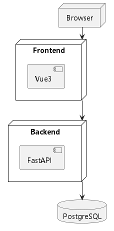
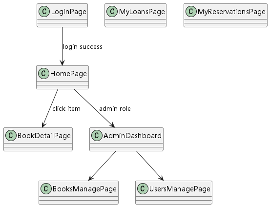
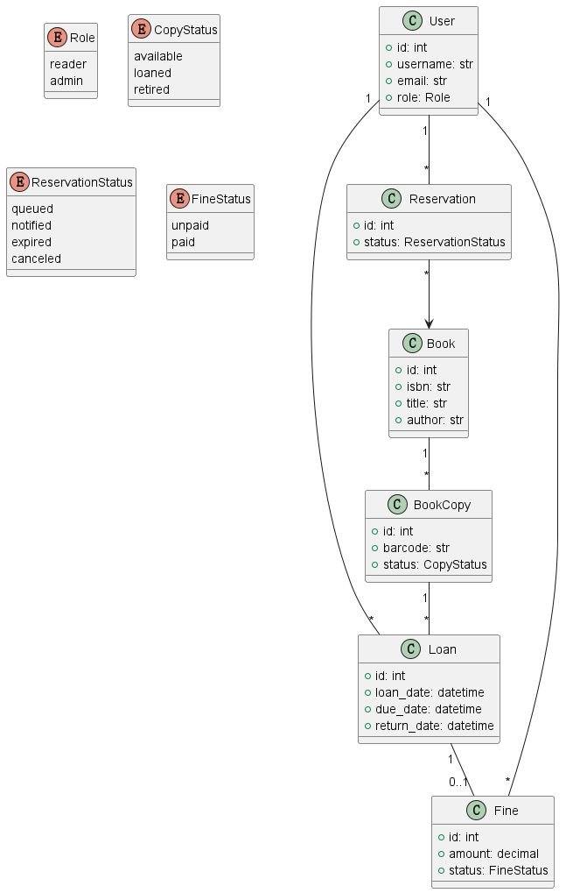
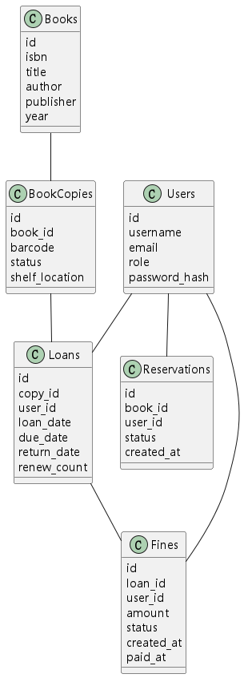
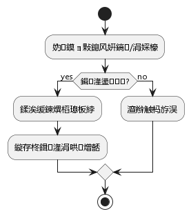
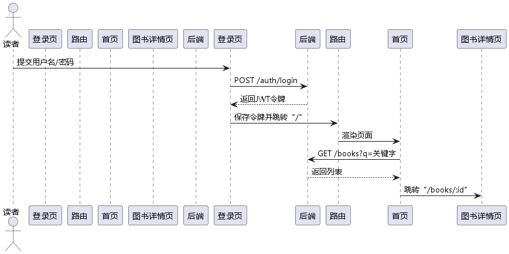
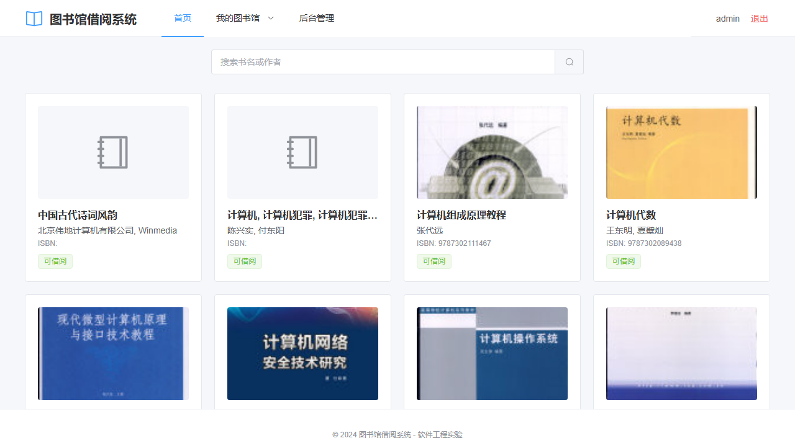
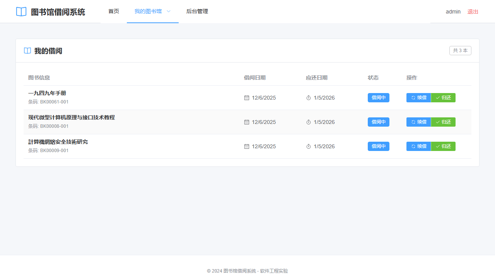
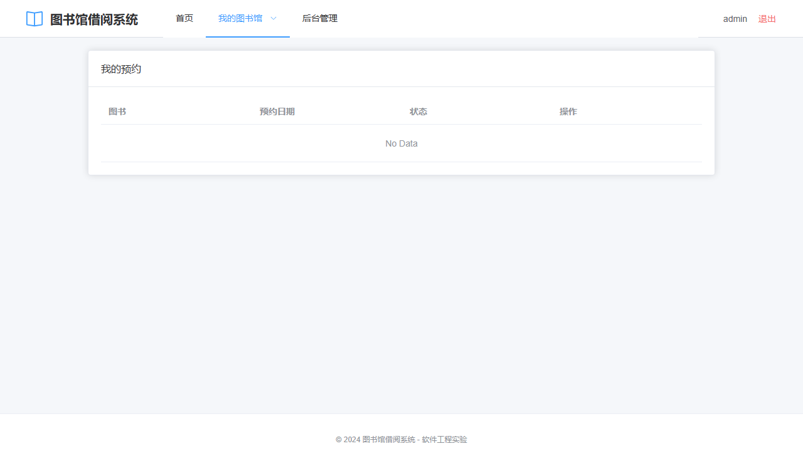
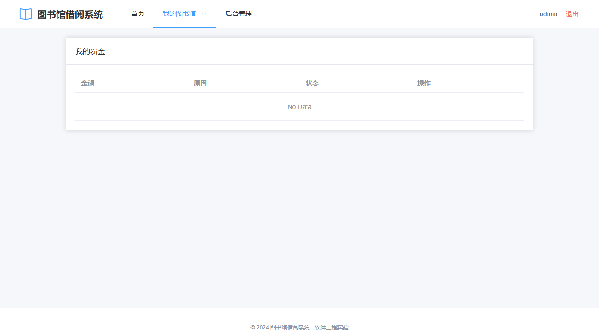

# 图书馆借阅系统 — 汇报PPT

课程实验完整交付：读者/管理员核心借阅业务系统

---

## 背景与目标

- 提供检索、借阅/归还/续借、预约与罚金功能
- 管理员维护书目/副本与用户，查看统计
- 目标：可运行、可测试、可部署的全栈系统

---

## 技术栈

- 后端：FastAPI、SQLAlchemy、Alembic、PostgreSQL
- 前端：Vue3、Pinia、Vue Router、Axios、Vite
- 测试：PyTest、Vitest、Playwright
- 文档与演示：MkDocs（静态站）、Marp（PPT）

---

## 架构设计

- 分层：API / Repositories / Services / Models
- 鉴权与角色：JWT + 路由守卫（管理员路由限制）
- 迁移：Alembic 管理数据库变更

---

## UML 总览（用例图）

---

## UML（包图 / 部署图）

---

## UML（构件图 / 界面类图）

---

## UML（领域类 / 数据设计类）

---

## UML（活动与顺序）

---

## 网站预览（首页 / 登录）

---

## 网站预览（我的借阅 / 预约 / 罚金）

---

## 核心流程说明

- 借阅：副本状态校验→创建借阅→到期时间计算→罚金联动
- 归还：归还时间记录→副本状态恢复→罚金结算
- 续借：借阅周期与次数限制→更新到期时间
- 预约：FIFO 队列→到书通知→过期处理

---

## 测试与结果

- 后端：集成测试通过（用户/图书/借阅流程）
- 前端：构建与基础测试通过
- E2E：Playwright 驱动页面与路由校验

---

## 部署与演示

- 文档站点：MkDocs，GitHub Pages 自动发布
- 后端：Uvicorn / Docker Compose，环境变量注入
- 前端：Vite 构建与静态资源部署

---

## 总结与展望

- 已实现核心借阅业务闭环
- 可继续完善：通知服务、刷新令牌、速率限制、统计可视化
