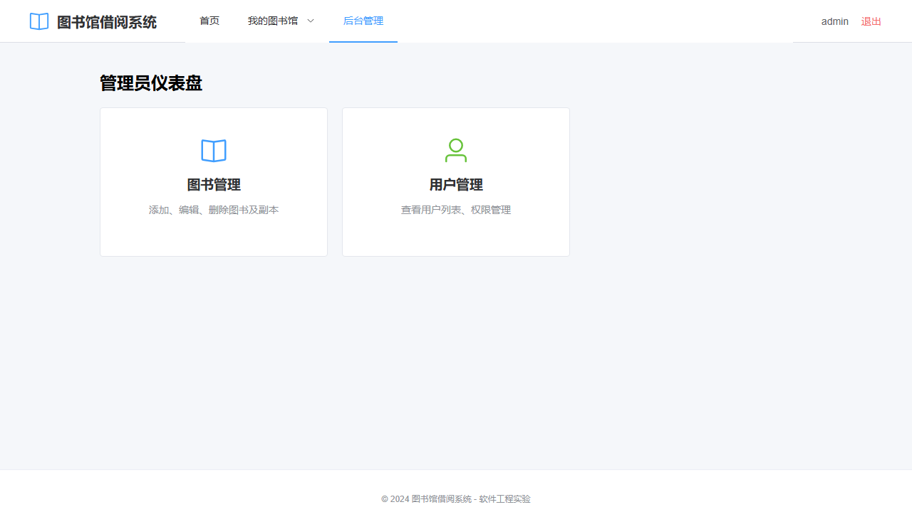

# 软件工程实验报告（图书馆借阅系统）

## 1. 需求获取与分析（20%）
- 自然语言需求：见 `docs/requirements.md`。
- 用例图：
  
  
  
  用例详细描述：`docs/usecases/*.md`（含前置/后置/基本/异常流程）。

## 2. 软件体系结构设计（20%）
- 包图：
  
  
  
- 部署图：
  
  
  
- 构件图：
  
  
  
- 用户界面设计：界面元素类图与跳转顺序图：
  
  
  
  

## 3. 软件详细设计（20%）
- 领域类图：
  
  
  
- 数据设计类图：
  
  
  
- 活动图（借阅/归还/预约）：
  
  
  
  
  
  
  
- 子系统与构件设计：用户、图书/副本、借阅、预约子系统顺序图与类图（结合上文图示）。

## 4. 软件实现与测试（20%）
- 技术栈：后端（FastAPI、SQLAlchemy、Alembic、PostgreSQL），前端（Vue3、Pinia、Vue Router、Axios），测试（PyTest、Vitest、Playwright）。
- 后端实现：分层架构（API/Repos/Services/Models），JWT鉴权，角色访问控制，借阅/归还/续借/预约/罚金业务逻辑；数据库迁移基于 Alembic。
- 前端实现：路由守卫（未登录跳转登录、管理员路由限制）、状态管理、页面与组件拆分；与后端 API 对接。
- 测试计划：单元/集成/端到端；后端集成测试见 `backend/tests/*`；前端测试：`frontend/tests` 与 `playwright.config.ts`；CI可执行构建与检查。
- 网站预览（本地开发截图）：
  
  
  
  
  
  
  
  
  
  
  
  

## 5. 版本管理与过程（10%）
- GitHub 仓库：分支策略（`main`/`dev`/`feat/*`/`fix/*`）、提交规范（语义化）。
- 自动化：MkDocs 部署静态文档至 GitHub Pages，Marp 生成汇报 PPT；CI 可扩展为构建与测试流水线。

## 6. 汇报材料（10%）
- PPT：结构见 `docs/ppt/outline.md`，配套演示步骤与截图。
- 现场答辩：15分钟演示 + 5分钟答疑（建议流程：需求→架构→核心流程→演示→测试→总结）。

## 7. 运行与部署
- Docker Compose：`ops/docker-compose.yml`；环境变量示例：`backend/.env.example`。
- 本地开发指南：见 `README.md`。

## 8. 总结与展望
- 已实现核心借阅流程与预约、罚金。
- 可改进点：预约到书通知自动化、刷新令牌与速率限制、统计图表可视化、权限粒度细化。

