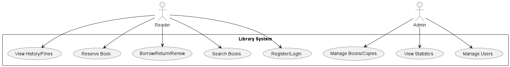

# 图书馆借阅系统 — 需求说明

## 总体目标
- 提供读者与管理员两类角色的核心借阅业务支持。

## 用户故事与用例（摘要）
- 读者注册/登录；搜索与查看图书；借阅/归还/续借；预约已借出图书；查看历史与罚金。
- 管理员维护图书与副本；管理用户；处理借阅/归还；查看统计报表。

### 用例总览

## 非功能需求
- 安全（密码哈希、JWT）；可用性（分页与筛选）；可维护性（分层架构、迁移）。

## 功能需求
- 账号与权限：注册、登录、退出；角色（读者/管理员）访问控制。
- 图书管理：书目维护（书名、作者、ISBN、分类、标签、封面）、副本维护（条码、馆藏位置、状态）。
- 检索浏览：关键词搜索、分类/作者筛选、分页与排序、详情页展示。
- 借阅业务：借阅、归还、续借；借阅规则（上限、借期、续借次数）；状态流转。
- 预约业务：对借出书籍发起预约、排队、到书通知、过期处理、取消预约。
- 罚金业务：超期罚金计算与记录、缴纳标记、历史查询。
- 我的：当前借阅与预约、历史记录、罚金记录、个人资料。
- 后台：用户管理、图书/副本管理、借阅流水、预约管理、统计报表。

## 业务约束与规则
- 借阅上限：默认每位读者最多同时借阅 5 本（可配置）。
- 借期与续借：初始借期 30 天；最多续借 1 次，每次 15 天（可配置）。
- 超期罚金：0.5 元/天（示例），按超期天数与副本归还时间计算；四舍五入到分。
- 预约队列：FIFO；通知后 48 小时未取书则过期（可配置）。
- 数据一致性：借阅/归还操作需在事务中完成，避免并发下状态不一致。

## 异常与错误处理
- 登录失败：用户名不存在或密码错误。
- 借阅失败：已达上限、存在未缴罚金、所选副本不可借。
- 预约失败：图书在馆有可借副本时不允许预约；重复预约同一书目。
- 归还失败：记录不存在或已归还；系统错误回滚。

## 性能与可用性要求
- 列表查询分页，支持关键词与常用索引字段检索。
- 服务可用：后端健康检查 `/health`；前端路由守卫与错误页。

## 安全要求
- 密码哈希存储（bcrypt）；JWT访问令牌（短期有效）。
- 管理端接口需角色授权；避免越权访问。

